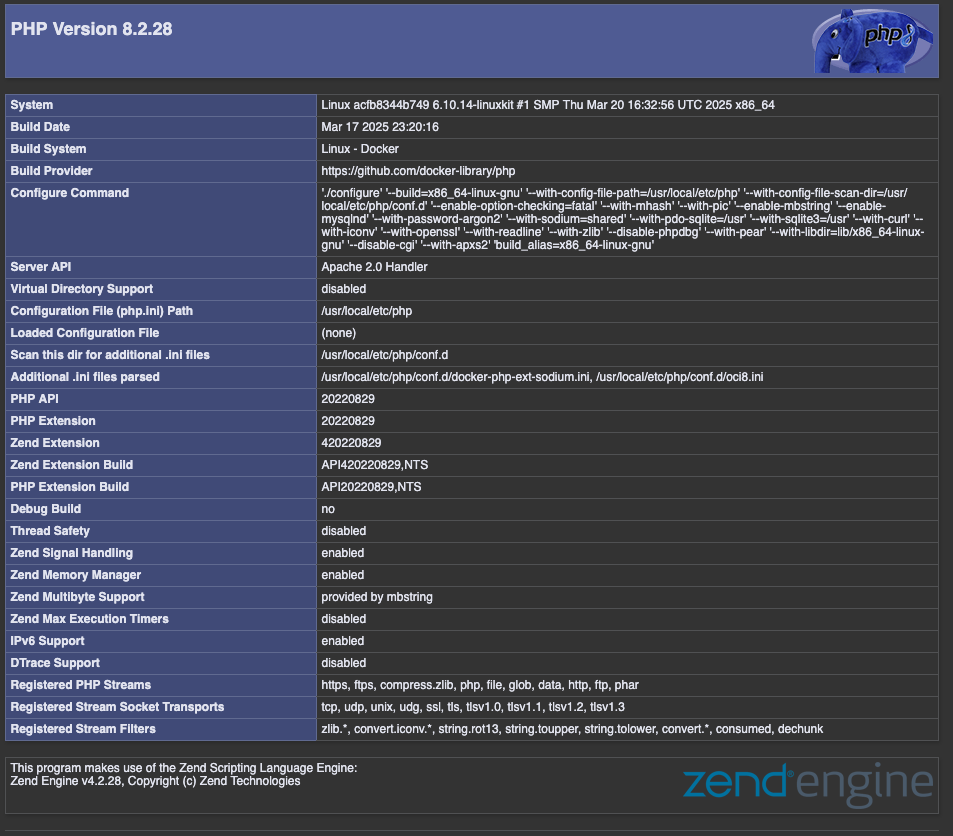
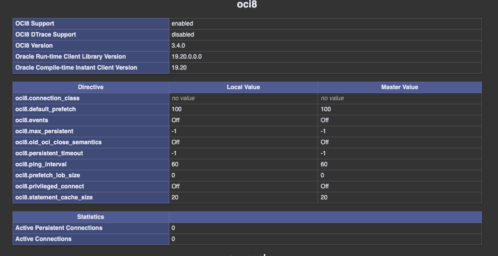

# Apache PHP 8.2 with OCI8

This project provides a Dockerized environment for running PHP 8.2 with Apache and the Oracle OCI8 extension.

[](https://github.com/wrenchpilot/apache-php82-oci8/actions/workflows/docker-image.yml)

## Features

- PHP 8.2 with Apache
- Oracle Instant Client 19.20.0.0.0 (Basic, SQLPlus, and SDK)
- OCI8 extension installed via PECL (3.4.0)
- Configurable Oracle environment variables
- Apache mod_rewrite enabled

## Prerequisites

- Docker and Docker Compose installed on your system
- Oracle database credentials (if connecting to a database)

## Usage

1. Clone this repository:

   ```bash
   cd apache-php82-oci8
   ```

2. Build the image:

   ```bash
   docker build -t apache-php82-oci8 .
   ```

3. Start the container:

   ```bash
   docker compose up -d
   ```

4. For production use, place your PHP application files in the `/opt/html` directory on your host machine. These will be mapped to `/var/www/html` in the container.

## Configuration

- The `docker-compose.yaml` file maps the host directory `/opt/html` to the container's `/var/www/html`. Update this path if needed.
- Oracle environment variables are set in the Dockerfile. Modify them if required.

## Stopping the Container

To stop the container, run:

```bash
docker compose down
```

## Troubleshooting

- Check the container logs for errors:

  ```bash
  docker logs apache-php82-oci8
  ```

## Versions

- PHP Info Screenshot:

  

- OCI8 Extension Screenshot:

  
